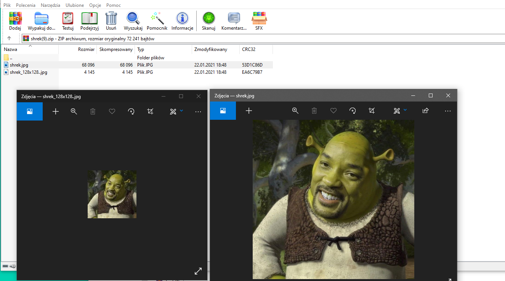

# Laboratorium numer 7

Laboratorium miało na celu zapoznanie się ze współpracą Redis + Django + Celery.

W ramach realizacji przerobiono zadania z [bloga](https://mmazurek.dev/tag/redis-i-python/?order=asc) oraz wykonano [projekt](https://stackabuse.com/asynchronous-tasks-in-django-with-redis-and-celery/) realizujący współpracę Django + Redis + Celery.

## Zrealizowana aplikacja:

Strona domowa:

Pobieranie wygenerowanego pliku:

Wygenerowane pliki: 

Celery:
